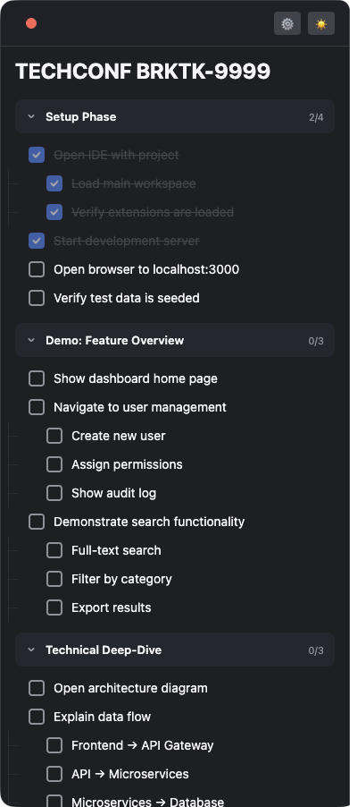

# StepSheet

[](https://github.com/scdozier/stepsheet/actions/workflows/ci.yml)

A menu bar app that displays an always-on-top checklist overlay for live demos and presentations. Load markdown files with task lists and track your progress during demos with keyboard shortcuts.

<p align="center">
  <picture>
    <source media="(prefers-color-scheme: dark)" srcset="docs/screenshot.png">
    <source media="(prefers-color-scheme: light)" srcset="docs/screenshot.png">
    
  </picture>
</p>

**Built for macOS and Windows. Tested on macOS only.**

## Features

- **Always-on-top overlay** — stays visible over other applications
- **Markdown-based checklists** — create task lists in plain markdown
- **Keyboard shortcuts** — navigate and complete items without mouse
- **Progress persistence** — checked items survive app restarts
- **Light/dark themes** — toggle to match your presentation
- **Adjustable text size** — scale from 80% to 150%
- **File library** — quick access to frequently used checklists
- **Click-through mode** — interact with apps behind the overlay

## Platform Support

| Platform | Status |
|----------|--------|
| macOS 12+ | ✅ Tested |
| Windows 10+ | ⚠️ Built, untested |

## Installation

### macOS (via Homebrew)

```bash
brew tap scdozier/stepsheet
brew install stepsheet
```

This builds the app from source on your machine, so no code signing is required.

### Windows

Download the installer from the [Releases](https://github.com/scdozier/stepsheet/releases) page.

### From Source

**Requirements:** Node.js 18+

```bash
git clone https://github.com/scdozier/stepsheet.git
cd stepsheet
npm install
npm run build
npm start
```

## Development

```bash
npm start          # Build and launch the app
npm run build      # Build TypeScript and bundle React
npm run watch      # Watch mode for TypeScript
npm run dist       # Create platform-specific installer in release/ folder
```

## Creating Markdown Files

StepSheet parses standard markdown with GitHub-style task lists.

### Format Guide

| Element | Syntax | Description |
|---------|--------|-------------|
| Title | `# Title` | Becomes the window title |
| Section | `## Section` | Groups related tasks |
| Task | `- [ ] Task` | Unchecked item |
| Completed | `- [x] Task` | Pre-checked item |
| Nested | `  - [ ] Subtask` | Indent with 2 spaces |
| Note | `<!-- comment -->` | Hidden presenter notes |
| Image | `` | Embedded images |

### Example Markdown File

```markdown
# Product Demo -- Customer Name

<!-- Remember to mute Slack before starting -->

## Setup
- [ ] Open IDE with project
  - [ ] Load workspace
  - [ ] Verify extensions loaded
- [ ] Start dev server
- [x] Seed test data

## Feature Demo
<!-- Keep this section to 5 minutes -->
- [ ] Show dashboard
- [ ] Navigate to user settings
  - [ ] Create new user
  - [ ] Assign permissions
- [ ] Demonstrate search
  - [ ] Full-text search
  - [ ] Filter by category

## Q&A
- [ ] Have benchmarks ready
- [ ] Roadmap slides available

## Wrap-up
- [ ] Share follow-up link
- [ ] Collect feedback
```

## Keyboard Shortcuts

| Shortcut | Action |
|----------|--------|
| `Cmd+Shift+N` | Jump to next unchecked item |
| `Cmd+Shift+X` | Mark current item complete |
| `Cmd+Shift+H` | Toggle overlay visibility |
| `Cmd+Shift+R` | Reload current markdown file |

## Settings

Access settings via the ⚙️ button in the header:

- **Theme toggle** (☀️/🌙) — Switch between light and dark mode
- **Highlight current step** — Visual indicator on the active item
- **Text size** — Adjust from 80% to 150%
- **Markdown Files** — File library for quick access to checklists

## Menu Bar

Click the menu bar icon for:

- **Load Markdown File...** — Open file picker
- **Toggle Overlay** — Show/hide the window
- **Click-Through Mode** — Allow clicks to pass through
- **Reset Checklist** — Uncheck all items
- **Quit** — Exit the application

## Contributing

Contributions are welcome! Please see [CONTRIBUTING.md](CONTRIBUTING.md) for guidelines.

## License

MIT
